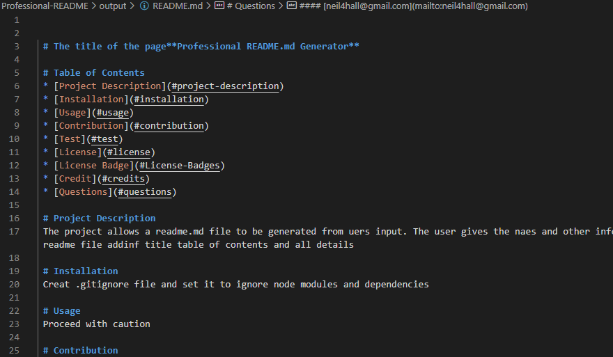
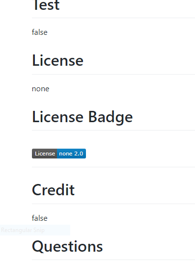
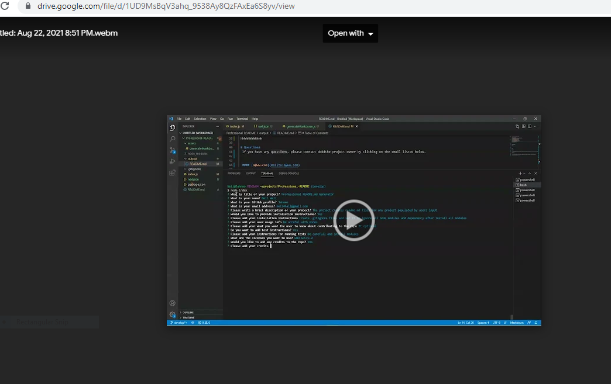

 # **Task**
 - Create an open source project in Github
 - Use command line with the help of node.js to create a README.md file
# **User Story**
 - As a developer
 - I want a README generator
    - so i can quickly create a professional README for a project
 # **Acceptance Criteria
  - GIVEN a command-line application that accepts user input
  - WHEN I am prompted for information about my application repository
  - Table of contents
  - Links to and from table of contents
  - Contributing factors
    - Installation tips
        - Usage information
            - License and badges
                - Credits
   - Links to email and Github profile
   # **Getting Started**
   - Clone respository with starter files and instructions
   - create .gitignore files and includes node module and dependencies
   - Create codes to handle users input and populate README.md files

   # **Installation**
   - nmp init 
   - node index ( run program)
   - console.log(inquirer) ensure package was installed
    
   
   # **ReadME.md **
   

   # ** Issues **
   - Getting inputs to correctly populate README
   - Some areas sdai undefined
   
   # **Video of Project**
    
   ]